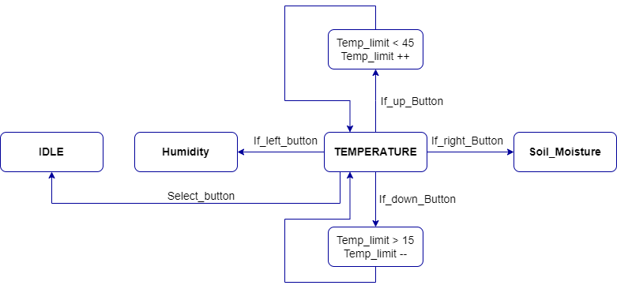

# Greenhouse monitoring and control system

### Team members

* Michal Baránek (219836)
* Tadeáš Bařina (223380)
* Alexander Bekeč (221096)
* Ladislav Drápal (223285)

Link to this file in your GitHub repository:

[https://github.com/alexander-bekec/Greenhouse_Project_DE2](https://github.com/alexander-bekec/Greenhouse_Project_DE2)

### Table of contents

* [Project objectives](#objectives)
* [Hardware description](#hardware)
* [Libraries description](#libs)
* [Main application](#main)
* [Video](#video)
* [References](#references)

## Project objectives

Cílem projektu je vytvořit ovládání a monitorování intenzity osvětlení, vlhkosti a teploty ve skleníku. U neinteligentních skleníků (které nemají možnost regulace dochází často k neodborné péči o rostliny, při malé vlhkosti půdy dochází k zasychání rostlin, při velké vlhkosti naopak rostliny chytají plíseň. U obou případů dojde k likvidaci rostlin, takže úroda bude malá nebo v nejhorších případech zcela zanikne. Tomu je ale konec. Bylo vytvořeno monitorování základních veličin ve skleníku. Tyto základní prvky jsou velmi důležité pro správný růst rostlin, zeleniny a ovoce uvnitř skleníku. Díky monitorování ze senzorů jsme schopni za včasu ovládat tyto základní prvky. Správným ovládáním osvětlení, vlhkosti a teploty máme zaručenou velice kvalitní úrodu. Už tedy nehrozí žádné zasychání.

## Hardware description

### V projektu byly použity tyto komponenty:
* 1x Mikrokontrolér ATMEGA328P
* 1x Displej HD44780 (16x2)
* 1x Moisture sensor V1.2
* 1x Fotorezistor GL5549 + rezistor 10k
* 1x I2C vlhkoměr a teploměr DHT12
* 4x červená LED dioda
* 4x rezistor 1k

### Schéma zapojení

## Libraries description

Knihovny byly použity z laboratorních cvičení z předmětu Digitální elektronika 2.

## Main application

### Stavové diagramy

#### Stavový diagram všech senzorů

#### Stavový diagram pro vlhkost

#### Stavový diagram pro teplotu

#### Stavový diagram pro senzor vlhkosti půdy

#### Stavový diagram pro senzor úrovně světla

### Popis kódu a simulace

## Video

Write your text here

## References

1. Write your text here.
