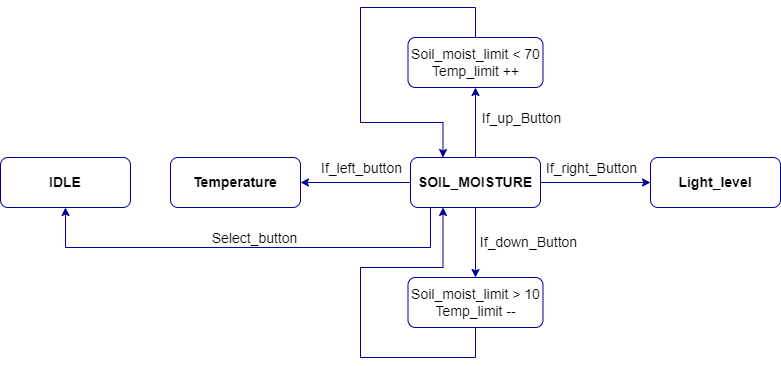

# Greenhouse monitoring and control system

### Team members

* Michal Baránek (219836) - návrh projektu a main funkcia, video
* Tadeáš Bařina (223380) - návrh projektu a main funkcia, schéma zapojenia
* Alexander Bekeč (221096) - návrh projektu a main funkcia, kód vlastných knižníc
* Ladislav Drápal (223285) - návrh projektu a main funkcia, state diagramy, dokumentácia

Link to this file in your GitHub repository:

[https://github.com/alexander-bekec/Greenhouse_Project_DE2](https://github.com/alexander-bekec/Greenhouse_Project_DE2)

### Table of contents

* [Project objectives](#objectives)
* [Hardware description](#hardware)
* [Libraries description](#libs)
* [Main application](#main)
* [Video](#video)
* [References](#references)

## Ciele projektu

Cílem projektu je vytvořit ovládání a monitorování intenzity osvětlení, vlhkosti a teploty ve skleníku. U neinteligentních skleníků (které nemají možnost regulace dochází často k neodborné péči o rostliny, při malé vlhkosti půdy dochází k zasychání rostlin, při velké vlhkosti naopak rostliny chytají plíseň. U obou případů dojde k likvidaci rostlin, takže úroda bude malá nebo v nejhorších případech zcela zanikne. Tomu je ale konec. Bylo vytvořeno monitorování základních veličin ve skleníku. Tyto základní prvky jsou velmi důležité pro správný růst rostlin, zeleniny a ovoce uvnitř skleníku. Díky monitorování ze senzorů jsme schopni za včasu ovládat tyto základní prvky. Správným ovládáním osvětlení, vlhkosti a teploty máme zaručenou velice kvalitní úrodu. Už tedy nebude hrozit žádné zasychání.

## Popis hardvéru

### V projektu byly použity tyto komponenty:
* 1x Mikrokontrolér ATMEGA328P
* 1x Displej Hd44780 (16x2)
* 1x Moisture sensor V1.2
* 1x Fotorezistor GL5549 + rezistor 10k
* 1x I2C vlhkoměr a teploměr DHT12
* 4x červená LED dioda
* 4x rezistor 1k

### Schéma zapojení

Na obrázku je schéma kompletního zapojení. Ze schématu je vidět, že snímače jsou zapojeny k výstupním pinům PD0-PD3 desky ATMEGA328P. Snímač vlhkosti půdy je připojen přes červenou LED diodu k napájení a signál je posílám přes PIN A0. Tlačítka jsou připojeny k pinu A2. LCD displej má připojení k pinům PB1, PB0 a PD4-PD7. Fotorezistor DHT12 je připojen k pinům SDA a SCL.

### Reálné zapojení

## Popis knižníc

Knihovny byly použity z laboratorních cvičení z předmětu Digitální elektronika 2. Byly to knihovny jako např. `gpio.h`, `timer.h`, `lcd.h`.

### Seznam použitých knihoven
* [gpio.h](https://github.com/alexander-bekec/Greenhouse_Project_DE2/blob/main/Project/greenhouse_controller_project/greenhouse_controller_project/gpio.h)
* [lcd.h](https://github.com/alexander-bekec/Greenhouse_Project_DE2/blob/main/Project/greenhouse_controller_project/greenhouse_controller_project/lcd.h)
* [timer.h](https://github.com/alexander-bekec/Greenhouse_Project_DE2/blob/main/Project/greenhouse_controller_project/greenhouse_controller_project/timer.h)
* [twi.h](https://github.com/alexander-bekec/Greenhouse_Project_DE2/blob/main/Project/greenhouse_controller_project/greenhouse_controller_project/twi.h)

Okrem knižníc použitých vrámci PC cvičení predmetu DE2 boli pre projekt vytvorené funkcie pre požadované zobrazenia na displeji `lcd_menu.h`, funkcia pre prevod ADC vstupu z tlačidiel na ľahšie spracovateľné hodnoty vrámci main funkcie `button.h` a funkcia pre rýchle požadované nastavenie ADC prevodníka `adc_control.h`.

## Main funkcia

### Stavové diagramy

#### Stavový diagram všech senzorů

U celkového stavového diagramu je znázorněno přepínání mezi jednotlivými senzory. Přepínání stavů je do uzavřené smyčky, kdy stisknutím pravého tlačítka se pohybujeme do prava a stiskem levého tlačítka vždy o krok zpět (do leva).

#### Stavový diagram pro vlhkost

#### Stavový diagram pro teplotu

#### Stavový diagram pro senzor vlhkosti půdy

#### Stavový diagram pro senzor úrovně světla

Ostatní stavové diagramy znázorňují stavy každého senzoru zvlášť. Tlačítka do leva a do prava znamenají jak už bylo řečeno přepnutí na další senzor. Horním a dolním tlačítkem se nastavují požadované hodnoty. Horním tlačítkem (Up) zvětšujeme a dolním tlačítkem (Down) snižujeme požadovanou hodnotu. Prostředním tlačítkem (Select) se vracíme do hlavního menu, označené IDLE.

### Popis kódu

#### `main.c`
[Link - main.c](https://github.com/alexander-bekec/Greenhouse_Project_DE2/blob/main/Project/greenhouse_controller_project/greenhouse_controller_project/main.c)

#### `button.c`
[Link - button.c](https://github.com/alexander-bekec/Greenhouse_Project_DE2/blob/main/Project/greenhouse_controller_project/greenhouse_controller_project/button.c)
V knižnici `button.c` sa nachádza funkcia pre prevod hodnôt z ADC prevodníka pre vstup z tlačidiel na ľahšie použiteľné hodnoty.

#### `adc_control.c`
[Link - adc_control.c](https://github.com/alexander-bekec/Greenhouse_Project_DE2/blob/main/Project/greenhouse_controller_project/greenhouse_controller_project/adc_control.c)
V knižnici `adc_control` je obsiahnutá funkcia pre rýchle nastavenie ADC prevodníka s predvolenými parametrami.

#### `lcd_menu.c`
[Link - lcd_menu.h](https://github.com/alexander-bekec/Greenhouse_Project_DE2/blob/main/Project/greenhouse_controller_project/greenhouse_controller_project/lcd_menu.c)
V knižnici `lcd_menu` sú funkcie pre správne vykreslenie jednotlivých menu pre merané veličiny. Funkcia `lcd_main_menu` vykresľuje na dispeji hlavnú (IDLE) obrazovku, na ktorej sú zobrazované redukované informácie z prijímaných snímačov (AH - air humidity, AT - air temperature, SM - soil moisture, LL - light level). Funkcie `lcd_..._menu` zobrazujú menu pre jednotlivé premenné, obsahujúce pri teplote a vlhkosti vzduchu presnejšiu hodnotu premennej s hodnotou na desatinnom mieste a nominálnu hodnotu danej premennej, od ktorej závisí spínanie regulujúcich prvkov prostredia (vetranie, tienenie,...).

### Diskuse

Cílem bylo navrhnout a zprovoznit systém monitorování a ovládání skleníku, který by pracoval autonomně s nastavenou nominální limitní hodnotou jednotlivé fyzikální veličiny (teplo, vlhkost, světlo...) a porovnal ji s hodnotou právě naměřenou s využitím senzorů vlhkosti půdy, intenzity světla, teploty a vlhkosti vzduchu. Tím pádem by se ve skleníku udržovaly stálé vnitřní podmínky prostředí podle zadaných parametrů uživatelem, například pro ideální růst různých druhů plodin. Tímto stylem by se zapínaly a vypínali podle potřeby externí části jako čerpadlo pro závlahu půdy, ventilátory pro udržení proudu vzduchu, vyvětrání pomocí elektronicky otevíratelnými okny nebo v případě potřeby příliš velké intezity světla, zatmění skleníku pomocí elektronických rolet. Tyto cíle byly v projektu splněny a implementovány. Samozřejmě zlepšeních je možno najít více, ale jedním zlepšení tohoto systému by bylo například připojení modulu s Wi-Fi nebo Bluetooth, které by bezdrátově posílali uživateli naměřené data prostředí ve skleníku, zaznamenávalo statistiky dlouhodobého prostředí a upozornili ho, pokud by ve skleníku nastala chyba a bylo ji třeba řešit. 

## Video

## Zdroje

1. [Arduino a LCD Display Shield](https://github.com/tomas-fryza/Digital-electronics-2/blob/master/Docs/arduino_shield.pdf)
2. [Datasheet DHT12](https://github.com/alexander-bekec/de2-project/blob/main/Project/sources/DHT12_humidity_temperature_sensor_datasheet.pdf)
3. [Datasheet fotoresistor](https://github.com/alexander-bekec/de2-project/blob/main/Project/sources/GL5549_SENBA.pdf)
4. [Datasheet senzor vlhkosti pôdy](https://github.com/alexander-bekec/de2-project/blob/main/Project/sources/capacitive_soil_moisture_sensor_datasheet.pdf)